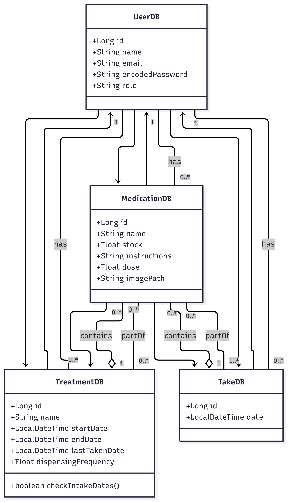

### Nombre del proyecto
**HealthCarer**

### Descripción del proyecto
HealthCarer es una aplicación web diseñada para ayudar a los usuarios a gestionar sus medicamentos de manera eficiente.

### Cómo ejecutar la aplicación en local

Para ejecutar localmente la aplicación debes tener **Docker** y **Docker Compose** instalados en tu sistema.

Una vez que tengas todo instalado,abre una terminal y sigue los siguientes pasos:

1.  **Clona el repositorio** de la aplicación desde GitHub.
    ```bash
    git clone Mandolin03/HealthCarer
    ```
    O si prefieres, puedes descargar el repositorio como un archivo ZIP y descomprimirlo en tu máquina local.
2.  **Navega al directorio** del proyecto clonado.
    ```bash
    cd HealthCarer
    ```
    Asegúrate de que el archivo `docker-compose.yml` esté presente en el directorio raíz del proyecto.
3.  Construye y levanta los servicios definidos en el archivo `docker-compose.yml`.
    ```bash
    docker-compose up --build
    ```
4.  Cuando los servicios estén funcionando, puedes **acceder a la aplicación** a través de un navegador web en `https://localhost:8443`.
5.  Para detener los servicios y liberar los recursos, puedes usar el siguiente comando en la terminal:
    ```bash
    docker-compose down
    ```

### Diagrama de clases del proyecto


### Diagrama de la base de datos


